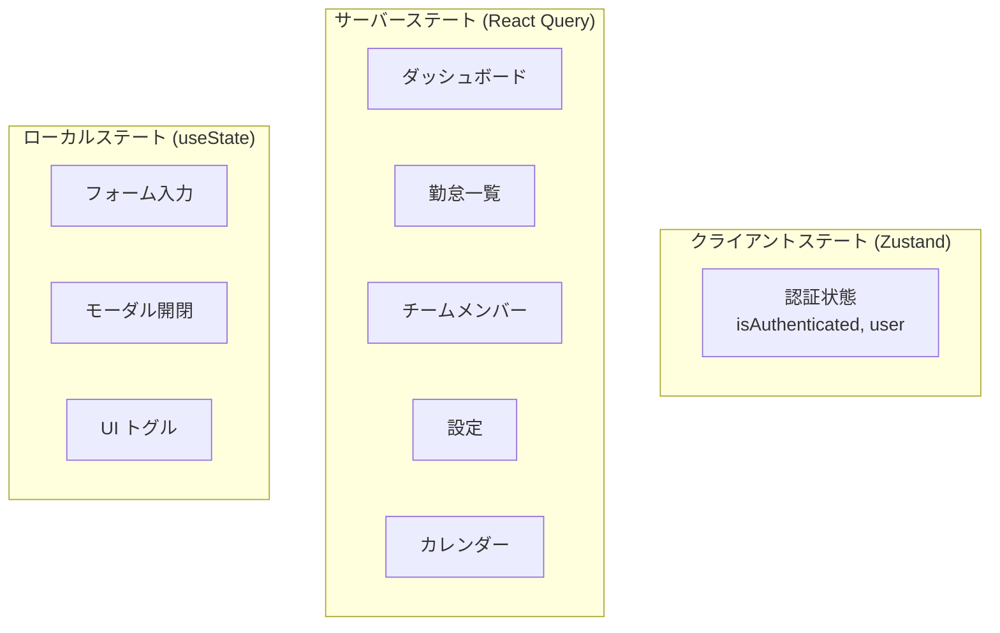

# Zustand ステートマネジメント

## 概要

グローバルステート管理に Zustand 5 を採用。認証状態のみ Zustand で管理し、サーバーデータは React Query に委譲する設計。

## ステート管理方針



| ステート種別 | 管理手段 | 例 |
|---|---|---|
| **クライアントステート** | Zustand | 認証状態、テーマ |
| **サーバーステート** | React Query | API レスポンスデータ |
| **ローカルステート** | `useState` | フォーム値、モーダル開閉 |

## Auth Store 実装

```typescript
// features/auth/state/useAuthStore.ts
import { create } from 'zustand';

interface AuthState {
    isAuthenticated: boolean;
    user: UserResponse | null;
    setAuth: (user: UserResponse, token: string) => void;
    clearAuth: () => void;
}

export const useAuthStore = create<AuthState>((set) => ({
    isAuthenticated: !!getAuthToken(),
    user: null,

    setAuth: (user, token) => {
        setAuthToken(token);
        set({ isAuthenticated: true, user });
    },

    clearAuth: () => {
        clearAuthToken();
        set({ isAuthenticated: false, user: null });
    },
}));
```

## useAuth フック

```typescript
// features/auth/hooks/useAuth.ts
export function useAuth() {
    const { isAuthenticated, user, setAuth, clearAuth } = useAuthStore();

    const login = async (credentials: LoginRequest) => {
        const result = await callResult(() => loginApi(credentials));
        if (result.ok) {
            setAuth(result.value.user, result.value.token);
        }
        return result;
    };

    const logout = async () => {
        await callResult(() => logoutApi());
        clearAuth();
    };

    return { isAuthenticated, user, login, logout };
}
```

## Zustand と React Query の境界

```mermaid
flowchart LR
    subgraph "ログイン"
        A[LoginPage] -->|login()| B[useAuth]
        B -->|setAuth| C[useAuthStore]
        B -->|API call| D[auth.api.ts]
    end

    subgraph "ダッシュボード"
        E[DashboardPage] -->|useQuery| F[useDashboardQueries]
        F -->|キャッシュ管理| G[React Query Cache]
        F -->|API call| H[dashboard.api.ts]
    end
```

## Store 設計ルール

```
✅ DO
├── 認証状態など「セッション全体で永続するクライアント状態」のみ Zustand
├── API データは React Query の useQuery / useMutation
├── フォーム状態は React Hook Form
├── UI 状態（モーダル開閉等）は useState
└── Store は feature/ 配下に配置

❌ DON'T
├── API レスポンスを Zustand に格納する
├── 巨大な Store を作る（分割する）
├── Store 内でフェッチロジックを書く
└── コンポーネントから直接 Store の内部状態を変更する
```

## 注意: 設計レビュー指摘事項

| 問題 | 影響 | 改善案 |
|---|---|---|
| **`isAuthenticated` の初期値が `!!getAuthToken()`** | トークンが期限切れでも `true` になる | 初回マウント時に `/authme` を呼んで検証するか、JWT をデコードして期限チェック |
| **`user` の初期値が `null`** | 認証済み（トークンあり）でもリロード後は `user` が null | `persist` ミドルウェアで localStorage に永続化するか、`/authme` で復元 |
| **Store が 1 つしかない** | 現状は問題ないが、設定テーマ等が増えたら肥大化 | テーマ用 `useThemeStore` を別途作成する |
| **Zustand DevTools 未設定** | デバッグ時にステート変化を追跡しにくい | `devtools` ミドルウェアを開発環境で有効化 |
| **Zustand の `persist` ミドルウェア未使用** | ページリロードで認証状態が失われる（トークンは localStorage にあるが user は null） | `persist` で `user` を sessionStorage に保存 |
