# Time Attendance System — Infrastructure Guide

## 1. 概要

React + Laravel + Docker による勤怠管理システム。  
nginx をリバースプロキシとし、フロントとバックを完全分離。  
ローカル・本番・CI で同一 Docker 構成を使用する。

---

## 2. アーキテクチャ図

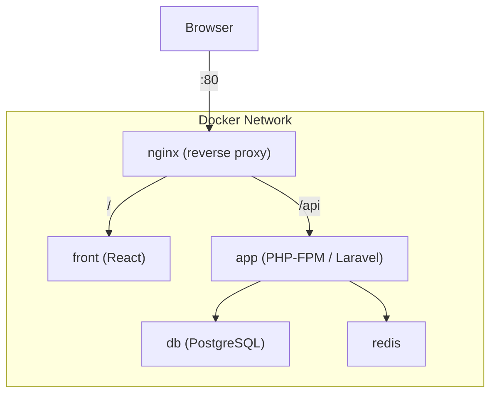

| パス | 転送先 | 備考 |
|------|--------|------|
| `/` | front (Vite:5173 / nginx:80) | dev=Vite, prod=nginx |
| `/api/*` | app:9000 (FastCGI) | Laravel |

---

## 3. ディレクトリ構成

```
root/
├── front/                   # React フロントエンド
│   ├── src/
│   ├── public/
│   ├── package.json
│   └── .env.example
│
├── back/                    # Laravel API バックエンド
│   ├── app/
│   ├── composer.json
│   ├── docker/
│   │   └── entrypoint.sh
│   └── .env.example
│
├── infra/                   # インフラ定義
│   ├── docker-compose.yml          # ベース（全環境共通）
│   ├── docker-compose.override.yml # dev オーバーライド（自動読込）
│   ├── docker-compose.prod.yml     # 本番オーバーライド
│   │
│   ├── nginx/
│   │   ├── nginx.conf              # メイン設定（gzip / server_tokens off）
│   │   └── conf.d/
│   │       ├── app.conf            # 本番用 server ブロック
│   │       ├── app.dev.conf        # 開発用 server ブロック（Vite proxy + HMR）
│   │       └── api.conf            # /api location（共通 include）
│   │
│   ├── php/
│   │   ├── Dockerfile              # PHP-FPM マルチステージ
│   │   ├── php.ini                 # 開発用 PHP 設定
│   │   ├── php.prod.ini            # 本番用 PHP 設定
│   │   └── xdebug.ini             # Xdebug（dev のみマウント）
│   │
│   ├── node/
│   │   ├── Dockerfile              # Node / React マルチステージ
│   │   └── entrypoint.sh           # pnpm install 自動実行
│   │
│   ├── postgres/
│   │   └── init.sql                # DB 初期化スクリプト
│   │
│   └── redis/
│
├── .env.example             # Docker Compose 変数テンプレート
├── Makefile
└── .gitignore
```

---

## 4. 環境変数

| 対象 | ファイル | 用途 |
|------|---------|------|
| Docker Compose | `.env` | ビルドターゲット / ポート / DB 接続情報 |
| Laravel | `back/.env` | アプリ設定（Docker 環境変数で上書き） |
| React | `front/.env.local` | Vite 変数（`VITE_` prefix） |

> **セキュリティ**: `.env` / `.env.local` は `.gitignore` 済み。`.env.example` のみ Git 管理。

---

## 5. セットアップ & 起動手順

### 5.1 初回セットアップ

```bash
# 1. リポジトリをクローン
git clone <repo-url> && cd time-attendance

# 2. 環境変数をコピー
cp .env.example .env
cp back/.env.example back/.env
cp front/.env.example front/.env.local

# 3. .env の POSTGRES_PASSWORD を変更
vi .env

# 4. ビルド & 起動 & DB 初期化
make setup
```

`make setup` は自動で以下を実行する:
1. `.env` ファイルが無ければコピー
2. Docker イメージをビルド
3. `php artisan key:generate` / `jwt:secret`
4. `php artisan migrate --seed`

### 5.2 日常の開発

```bash
make up          # 起動    → http://localhost
make down        # 停止
make build       # イメージ再ビルド & 起動
make logs        # ログ確認
make sh          # app コンテナに入る
```

### 5.3 本番ビルド

```bash
make build ENV=prod
make up ENV=prod
```

---

## 6. Make コマンド一覧

| コマンド | 説明 |
|---------|------|
| `make setup` | 初回セットアップ（.env コピー + ビルド + DB 初期化） |
| `make up` | コンテナ起動 |
| `make down` | コンテナ停止 |
| `make build` | ビルド & 起動 |
| `make restart` | down → up |
| `make logs` | ログ表示 |
| `make ps` | コンテナ一覧 |
| `make sh` | app コンテナに入る |
| `make migrate` | マイグレーション実行 |
| `make seed` | シーダー実行 |
| `make fresh` | DB リセット + migrate + seed |
| `make test` | テスト実行 |

本番は `ENV=prod` を付与:

```bash
make up ENV=prod
make build ENV=prod
```

---

## 7. dev / prod の差分

| 項目 | dev (override.yml) | prod (prod.yml) |
|------|-------------------|-----------------|
| PHP Dockerfile target | `dev` | `prod` |
| Front Dockerfile target | `dev` (Vite) | `prod` (nginx + 静的ファイル) |
| Xdebug | 有効（xdebug.ini マウント） | 無効 |
| nginx app.conf | `app.dev.conf`（Vite proxy） | `app.conf`（frontend upstream） |
| ソースマウント | back/ / front/ をバインド | イメージに COPY |
| DB/Redis ポート | ホストに公開 | 公開しない |
| PHP エラー表示 | `display_errors = On` | `display_errors = Off` |
| opcache | `validate_timestamps = 1` | `validate_timestamps = 0` |
| リソース制限 | なし | `mem_limit` / `cpus` 設定済み |
| ログ | stdout | json-file (max-size 10m × 3) |

---

## 8. nginx ルーティング詳細

### 全体フロー

```
nginx.conf
  └── include conf.d/app.conf
        └── include conf.d/api.conf
```

- `nginx.conf`: gzip, server_tokens off, worker 設定
- `app.conf` (prod): upstream frontend → front:80 (nginx)
- `app.dev.conf` (dev): upstream frontend → front:5173 (Vite) + WebSocket upgrade
- `api.conf`: `/api` → PHP-FPM (fastcgi_pass app:9000)

### CORS を発生させない仕組み

ブラウザは `localhost:80` (nginx) にのみアクセスする。  
`/api` も同一オリジン経由で nginx が PHP-FPM に中継するため、CORS ヘッダは不要。

---

## 9. よくあるエラーと対処

### DB に接続できない

```
SQLSTATE[08006] Connection refused
```

**原因**: `DB_HOST=localhost` になっている。  
**対処**: Docker 内では `DB_HOST=db`（サービス名）を使う。Compose の `environment` で自動注入される。

### CORS エラー

```
Access-Control-Allow-Origin header is missing
```

**原因**: フロントが `localhost:5173` から直接 `localhost:8000/api` を叩いている。  
**対処**: すべて nginx (`:80`) 経由でアクセスする。Vite の `VITE_API_BASE_URL=/api`（相対パス）を確認。

### front コンテナで node_modules が空

```
Error: Cannot find module 'vite'
```

**原因**: Volume マウントが node_modules を上書きしている。  
**対処**: `entrypoint.sh` が自動で `pnpm install` を実行する。初回は時間がかかる。

### nginx 502 Bad Gateway

**原因**: app コンテナ（PHP-FPM）がヘルスチェック前にリクエストを受けた。  
**対処**: nginx は `depends_on: app: condition: service_healthy` で待機する。ヘルスチェック通過まで待つ。

### Xdebug が動かない

**原因**: `xdebug.client_host=host.docker.internal` が Linux で解決できない。  
**対処**: Linux の場合、`infra/php/xdebug.ini` の `client_host` をホストの Docker ブリッジ IP (例: `172.17.0.1`) に変更する。

### PHP artisan コマンドが失敗

```
The bootstrap/cache directory must be writable
```

**対処**: `make sh` でコンテナに入り、`chmod -R ug+rwX storage bootstrap/cache` を実行。entrypoint.sh が自動で対処するが、UID 不一致の場合は手動で修正。

---

## 10. アンチパターン（やってはいけないこと）

### 1. `.env` を Git にコミットする

秘密情報（DB パスワード、JWT_SECRET 等）が漏洩する。  
→ `.env.example` のみコミットし、`.env` は `.gitignore` で除外済み。

### 2. Docker を使わずにローカルで直接起動する

PHP / Node のバージョン差異で環境依存バグが発生する。  
→ 必ず Docker 経由で開発する。

### 3. `localhost:5173` を直接ブラウザで開く

CORS エラーが発生する。nginx を経由しないと API リクエストが別オリジンになる。  
→ `http://localhost`（nginx 経由）にアクセスする。

### 4. DB ポートをホストに公開したまま本番にデプロイする

`docker-compose.override.yml` の `ports: 5432:5432` は dev 限定。  
→ 本番では `docker-compose.prod.yml` を使用し、DB/Redis ポートは外部公開しない。

### 5. 本番で Xdebug を有効にする

Xdebug は PHP の実行速度を大幅に低下させる。  
→ `infra/php/xdebug.ini` は `docker-compose.override.yml` でのみマウントされる。

### 6. `node_modules` をホストからバインドマウントする

OS 依存のネイティブモジュール（esbuild 等）が壊れる。  
→ `front_node_modules` 名前付きボリュームで隔離済み。

### 7. `docker-compose.prod.yml` で `APP_DEBUG=true` にする

スタックトレースやデバッグ情報がブラウザに表示される。  
→ 本番では `APP_DEBUG=false` を厳守。

### 8. nginx を飛ばして PHP-FPM に直接リクエストする

FastCGI プロトコルは HTTP ではない。`curl app:9000` は動かない。  
→ 必ず nginx → FastCGI 経由でアクセスする。

### 9. `docker compose up` を infra ディレクトリ外で `-f` なしに実行する

Compose ファイルが見つからずエラーになるか、間違ったファイルが読み込まれる。  
→ `make up` を使うか、`-f` でパスを明示する。

### 10. 全コンテナを同一メモリ制限にする

DB に 128MB、Redis に 1GB 等の不適切な割り当ては OOM を招く。  
→ `docker-compose.prod.yml` でサービスごとに適切な `mem_limit` を設定済み。

---

## 11. 今後の拡張

- AWS デプロイ（ECS / Fargate / RDS / ElastiCache / S3 / CloudFront）
- CI/CD（GitHub Actions: lint → test → build → deploy）
- メールサービス（Mailpit for dev / SES for prod）
- ログ集約（CloudWatch / Datadog）

---
---

# Part 2 — 開発・運用ガイド（拡張編）

> 以降は開発環境の効率化、デプロイ手順の詳細、運用上の注意点、  
> チェックリスト等を網羅し、**新規参画メンバーがこの 1 文書だけで自走できる** ことを目指す。

---

## 12. 開発環境を快適にする

### 12.1 pnpm キャッシュの活用と高速化

pnpm はデフォルトでグローバルストア (`~/.local/share/pnpm/store`) にパッケージを保持する。  
Docker 内ではこのストアを **名前付きボリューム** にすることで再ビルド時のインストールを高速化できる。

```yaml
# docker-compose.override.yml（既存設定に追記する場合の例）
services:
  front:
    volumes:
      - pnpm_store:/root/.local/share/pnpm/store

volumes:
  pnpm_store:
```

| テクニック | 効果 |
|-----------|------|
| `pnpm install --frozen-lockfile` | lockfile と package.json の不整合を即検出 |
| `pnpm store prune` | 未参照パッケージを削除して容量節約 |
| `docker layer cache` | Dockerfile で `COPY pnpm-lock.yaml` → `pnpm install` → `COPY src/` の順で最大限キャッシュ |

> **Tips**: CI でも `actions/cache` で `~/.local/share/pnpm/store` をキャッシュするとインストール時間を 60–80% 短縮できる。

### 12.2 node_modules バインドマウントの注意点

本プロジェクトでは **名前付きボリューム `front_node_modules`** で `node_modules` を隔離している。

```yaml
# docker-compose.override.yml
volumes:
  - ../front:/app                     # ソースコードをバインドマウント
  - front_node_modules:/app/node_modules  # OS 依存回避
```

#### なぜホストの node_modules を直接マウントしないのか

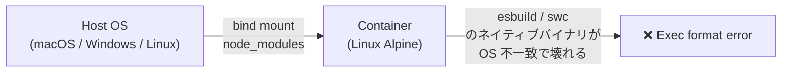

| 症状 | 原因 | 対処 |
|------|------|------|
| `Error: Cannot find module 'esbuild'` | ホスト OS のバイナリがコンテナ内で実行不可 | 名前付きボリュームを使用（設定済み） |
| `pnpm install` 後もモジュール不足 | ボリュームの古いキャッシュ | `docker volume rm time-attendance_front_node_modules` → 再ビルド |
| ホスト側の IDE 補完が効かない | ホストに node_modules がない | ホストでも `cd front && pnpm install` を実行 |

### 12.3 Laravel artisan コマンドの便利な使い方

すべて `make sh` でコンテナに入ってから実行するか、ワンライナーで叩く。

```bash
# コンテナ内で直接実行（ワンライナー）
docker compose -f infra/docker-compose.yml -f infra/docker-compose.override.yml \
  exec app php artisan <command>

# もしくは Makefile 経由
make sh
# → コンテナ内で:
php artisan <command>
```

#### よく使うコマンド一覧

| コマンド | 用途 |
|---------|------|
| `php artisan tinker` | 対話式 REPL。モデル操作やクエリ確認に最適 |
| `php artisan make:model Foo -mfsc` | Model + Migration + Factory + Seeder + Controller を一括生成 |
| `php artisan route:list --path=api` | API ルートの一覧表示 |
| `php artisan config:clear` | 設定キャッシュクリア（`.env` 変更後に必要） |
| `php artisan cache:clear` | アプリキャッシュクリア |
| `php artisan queue:work --tries=3` | キューワーカー起動 |
| `php artisan test --filter=AttendanceTest` | 特定テストのみ実行 |
| `php artisan db:show` | DB 接続情報 & テーブル数を表示 |
| `php artisan migrate:status` | マイグレーション適用状況の確認 |
| `php artisan schedule:list` | スケジュールタスクの一覧 |

> **危険コマンド**: `migrate:fresh` は **全テーブルを DROP** する。本番では絶対に実行しない。  
> Makefile の `make fresh` も dev 限定で使うこと。

### 12.4 ホスト側での開発（IDE 補完・型チェック）

Docker コンテナ内でアプリを動かしつつ、ホスト側 IDE でコード編集する構成。

```bash
# ホスト側で依存をインストール（IDE 補完用）
cd front && pnpm install
cd ../back && composer install

# 型チェック・リント（ホスト側で実行可能）
cd front && pnpm typecheck && pnpm lint
```

> ホスト側の `node_modules` / `vendor` はあくまで **IDE 補完用**。  
> 実行は常に Docker コンテナ内で行う。

---

## 13. マルチステージビルド詳細

### 13.1 PHP イメージ（infra/php/Dockerfile）

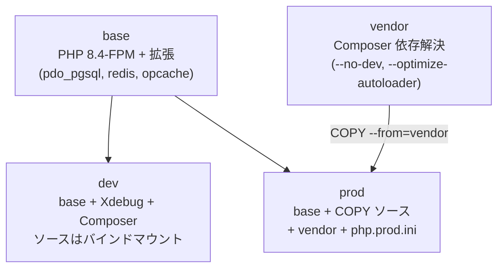

| ステージ | 含まれるもの | サイズ目安 |
|---------|-------------|-----------|
| `base` | PHP-FPM + 必要な拡張 | ~180 MB |
| `vendor` | Composer 依存（本番のみ） | 一時ステージ |
| `dev` | base + Xdebug + Composer CLI | ~220 MB |
| `prod` | base + アプリコード + vendor | ~210 MB |

#### ビルドキャッシュを効かせるコツ

```dockerfile
# ✅ Good: 依存ファイルだけ先にコピー → install → ソースコピー
COPY back/composer.json back/composer.lock ./
RUN composer install --no-dev --no-scripts
COPY back/ .

# ❌ Bad: ソースを先にコピーすると、1 行変更でも install からやり直し
COPY back/ .
RUN composer install
```

### 13.2 Node イメージ（infra/node/Dockerfile）

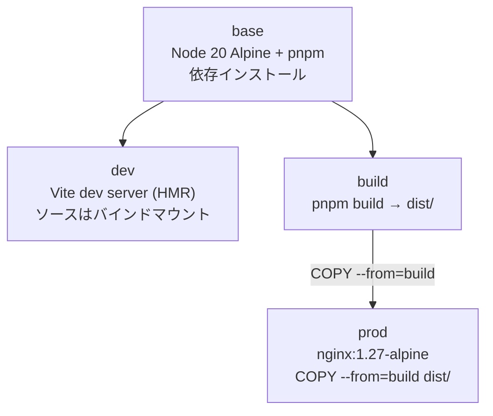

| ステージ | 目的 | 最終イメージサイズ |
|---------|------|-----------------|
| `base` | 依存インストール（キャッシュ層） | — |
| `dev` | Vite dev server + HMR | ~350 MB |
| `build` | `pnpm build` 実行 | 一時ステージ |
| `prod` | nginx で静的ファイル配信 | ~45 MB |

> **本番イメージに Node.js は含まれない**。nginx:alpine のみで静的ファイルを配信するため非常に軽量。

---

## 14. デプロイ手順

### 14.1 ローカル本番ビルド（検証用）

```bash
# 1. 本番イメージをビルド & 起動
make build ENV=prod

# 2. DB マイグレーション
make migrate ENV=prod

# 3. Laravel 最適化（config / route / view キャッシュ）
docker compose -f infra/docker-compose.yml -f infra/docker-compose.prod.yml \
  exec app php artisan optimize

# 4. 動作確認
curl -fsS http://localhost/api/health && echo "✅ OK"
```

### 14.2 本番デプロイフロー（CI/CD）

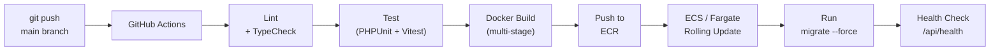

#### GitHub Actions ワークフロー例

```yaml
# .github/workflows/deploy.yml
name: Deploy

on:
  push:
    branches: [main]

jobs:
  deploy:
    runs-on: ubuntu-latest
    permissions:
      id-token: write
      contents: read

    steps:
      - uses: actions/checkout@v4

      # ── Lint & Test ───────────────────────────────────
      - uses: pnpm/action-setup@v4
      - uses: actions/setup-node@v4
        with:
          node-version: 20
          cache: pnpm
          cache-dependency-path: front/pnpm-lock.yaml

      - run: cd front && pnpm install --frozen-lockfile
      - run: cd front && pnpm typecheck
      - run: cd front && pnpm lint

      # ── Docker Build & Push ───────────────────────────
      - uses: aws-actions/configure-aws-credentials@v4
        with:
          role-to-assume: ${{ secrets.AWS_ROLE_ARN }}
          aws-region: ap-northeast-1

      - uses: aws-actions/amazon-ecr-login@v2
        id: ecr

      - name: Build & Push app image
        run: |
          docker build -f infra/php/Dockerfile --target prod \
            -t ${{ steps.ecr.outputs.registry }}/app:${{ github.sha }} .
          docker push ${{ steps.ecr.outputs.registry }}/app:${{ github.sha }}

      - name: Build & Push front image
        run: |
          docker build -f infra/node/Dockerfile --target prod \
            --build-arg VITE_API_BASE_URL=/api \
            -t ${{ steps.ecr.outputs.registry }}/front:${{ github.sha }} .
          docker push ${{ steps.ecr.outputs.registry }}/front:${{ github.sha }}

      # ── Deploy ────────────────────────────────────────
      - name: Update ECS service
        run: |
          aws ecs update-service \
            --cluster time-attendance \
            --service app \
            --force-new-deployment
```

### 14.3 本番 nginx 設定の確認ポイント

| 項目 | 設定値 | 理由 |
|------|--------|------|
| `server_tokens off` | ✅ 設定済み | nginx バージョン非公開（情報漏洩対策） |
| `gzip on` | ✅ 設定済み | 転送量削減（JS/CSS/JSON を圧縮） |
| `gzip_comp_level 6` | ✅ 設定済み | CPU 負荷とのバランスが良い値 |
| `X-Frame-Options` | `SAMEORIGIN` | クリックジャッキング防止 |
| `X-Content-Type-Options` | `nosniff` | MIME スニッフィング防止 |
| `Referrer-Policy` | `strict-origin-when-cross-origin` | リファラ情報の過剰送信を防止 |
| `client_max_body_size` | `20m` | アップロード上限（必要に応じて調整） |
| dotfile アクセス拒否 | `deny all` | `.env` / `.git` 等の漏洩防止 |

> **追加推奨ヘッダ**（必要に応じて `app.conf` に追加）:
> ```nginx
> add_header Strict-Transport-Security "max-age=31536000; includeSubDomains" always;
> add_header Content-Security-Policy "default-src 'self'; script-src 'self'; style-src 'self' 'unsafe-inline'" always;
> add_header Permissions-Policy "camera=(), microphone=(), geolocation=()" always;
> ```

### 14.4 DB / Redis ポートを本番で非公開にする理由

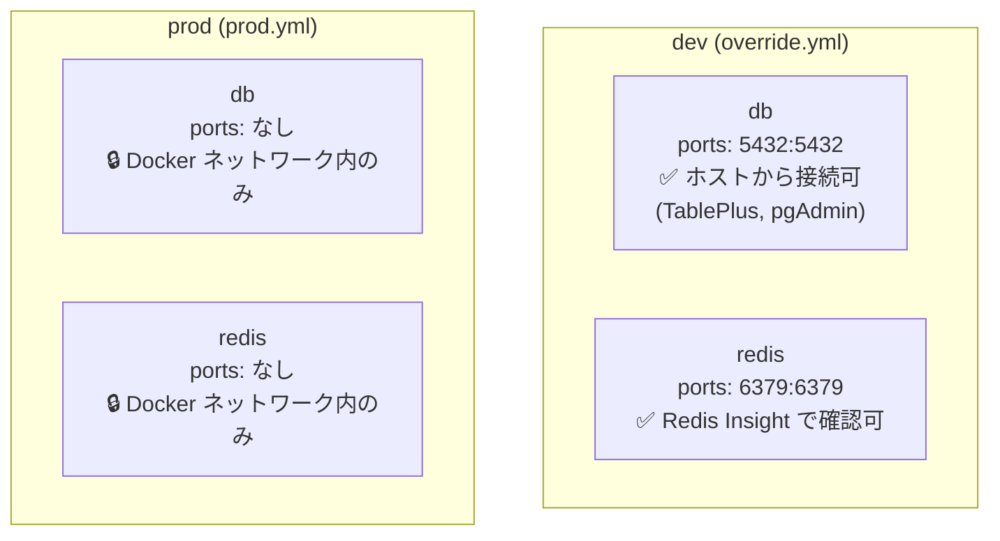

| 理由 | 説明 |
|------|------|
| **攻撃対象面の最小化** | ポートを公開しなければ外部から直接接続不可 |
| **ブルートフォース防止** | DB パスワード総当たり攻撃を根本的に防ぐ |
| **意図しない接続を防止** | 他のアプリやスクリプトが誤って接続するリスクを排除 |
| **Docker ネットワークで十分** | app コンテナはサービス名で内部通信可能 |

---

## 15. セキュリティ ベストプラクティス

### 15.1 概要

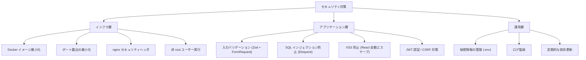

### 15.2 チェックリスト

- [ ] `.env` ファイルが `.gitignore` に含まれている
- [ ] `POSTGRES_PASSWORD` がデフォルト (`change_me`) から変更されている
- [ ] `APP_DEBUG=false` が本番で設定されている
- [ ] `APP_KEY` と `JWT_SECRET` が生成されている
- [ ] nginx の `server_tokens off` が有効
- [ ] dotfile へのアクセスが `deny all` で拒否されている
- [ ] DB / Redis ポートが本番で非公開
- [ ] Xdebug が本番イメージに含まれていない
- [ ] Docker イメージのベースが定期的に更新されている
- [ ] `composer audit` / `pnpm audit` でゼロ脆弱性

---

## 16. パフォーマンス最適化

### 16.1 Laravel（バックエンド）

| 対策 | コマンド / 設定 | 効果 |
|------|---------------|------|
| 設定キャッシュ | `php artisan config:cache` | 毎リクエストの .env パースを省略 |
| ルートキャッシュ | `php artisan route:cache` | ルート解決を高速化 |
| ビューキャッシュ | `php artisan view:cache` | Blade テンプレートを事前コンパイル |
| 一括最適化 | `php artisan optimize` | 上記 3 つ + イベントキャッシュ |
| OPcache | `php.prod.ini` で有効 | PHP バイトコードをメモリキャッシュ |
| Redis セッション | `SESSION_DRIVER=redis` | ファイル I/O 削減 |
| Redis キャッシュ | `CACHE_DRIVER=redis` | DB クエリ結果のキャッシュ |
| Autoload 最適化 | `composer install --optimize-autoloader` | クラスマップ生成で高速化 |

```bash
# 本番デプロイ時の最適化コマンドまとめ
make sh  # コンテナに入る
php artisan optimize        # config + route + view + event キャッシュ
composer dump-autoload -o   # autoload 最適化
```

### 16.2 React（フロントエンド）

| 対策 | 実装 | 効果 |
|------|------|------|
| コード分割 | `React.lazy()` + `Suspense` | 初期ロード時間短縮 |
| Tree-shaking | Vite のデフォルト挙動 | 未使用コードの除去 |
| gzip 圧縮 | nginx で設定済み | 転送量 60–80% 削減 |
| アセットハッシュ | Vite のデフォルト挙動 | 長期キャッシュ可能 |
| React Query | `staleTime` / `gcTime` 設定 | 不要な API リフェッチ抑制 |
| ソースマップ | `build.sourcemap: true` | 本番デバッグ用（必要に応じて `false`） |

### 16.3 Docker / インフラ

| 対策 | 設定場所 | 効果 |
|------|---------|------|
| Alpine ベースイメージ | Dockerfile | イメージサイズ削減 |
| マルチステージビルド | Dockerfile | 最終イメージに不要物を含めない |
| Docker layer cache | Dockerfile の順序 | リビルド時間短縮 |
| リソース制限 | `docker-compose.prod.yml` | OOM / CPU 枯渇防止 |
| `sendfile on` | nginx.conf | カーネルレベルのファイル送信で高速化 |
| `tcp_nopush` / `tcp_nodelay` | nginx.conf | ネットワーク効率の向上 |

---

## 17. 保守性ガイドライン

### 17.1 依存パッケージの更新

```bash
# ── PHP（Laravel） ──
make sh
composer outdated          # 更新可能パッケージの確認
composer update --dry-run  # 実行せずに影響を確認
composer update            # 実際に更新
composer audit             # 既知の脆弱性チェック

# ── Node（React） ──
cd front
pnpm outdated                   # 更新可能パッケージの確認
pnpm update --interactive       # 対話式で選択して更新
pnpm audit                      # 脆弱性チェック
```

#### 更新頻度の目安

| カテゴリ | 頻度 | 例 |
|---------|------|---|
| セキュリティパッチ | 即時 | `composer audit` / `pnpm audit` で警告が出たら |
| マイナーバージョン | 月次 | React 19.x.y → 19.x.z |
| メジャーバージョン | 四半期 | PHP 8.x → 8.y, Vite 7 → 8 |
| Docker ベースイメージ | 月次 | `node:20-alpine`, `php:8.4-fpm` |

### 17.2 ログの確認

```bash
# 全コンテナのログを追従
make logs

# 特定コンテナのログ
docker compose -f infra/docker-compose.yml -f infra/docker-compose.override.yml \
  logs -f app

# Laravel ログ（コンテナ内）
make sh
tail -f storage/logs/laravel.log

# nginx アクセスログ
docker compose -f infra/docker-compose.yml -f infra/docker-compose.override.yml \
  exec nginx cat /var/log/nginx/access.log | tail -50
```

### 17.3 DB バックアップ & リストア

```bash
# バックアップ（ホストに出力）
docker compose -f infra/docker-compose.yml -f infra/docker-compose.override.yml \
  exec db pg_dump -U time_attendance time_attendance > backup_$(date +%Y%m%d).sql

# リストア
docker compose -f infra/docker-compose.yml -f infra/docker-compose.override.yml \
  exec -T db psql -U time_attendance time_attendance < backup_20260320.sql
```

### 17.4 OpenAPI スキーマ駆動開発

本プロジェクトでは OpenAPI 定義からクライアントコードと Zod バリデーターを自動生成している。

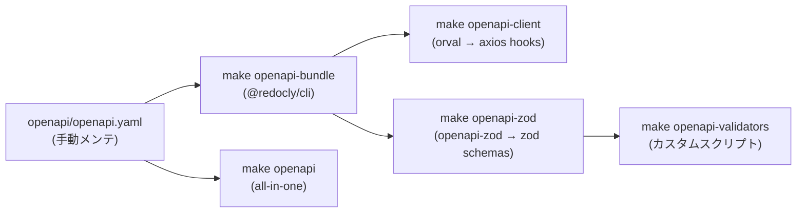

```bash
# OpenAPI 定義を変更した後、一括で再生成
make openapi

# 個別に実行する場合
make openapi-bundle      # YAML をバンドル
make openapi-client      # orval で API クライアント生成
make openapi-zod         # Zod スキーマ生成
make openapi-validators  # バリデーター生成
```

> **注意**: 自動生成ファイル（`front/src/__generated__/`）を手動編集しないこと。  
> OpenAPI 定義を変更して `make openapi` で再生成する。

---

## 18. ハマりやすいポイント（詳細版）

### 18.1 Vite / HMR の設定ミス

| 症状 | 原因 | 解決策 |
|------|------|--------|
| HMR が動かない（ブラウザリロードが必要） | WebSocket の `Upgrade` ヘッダが nginx で中継されていない | `app.dev.conf` で `proxy_set_header Upgrade $http_upgrade` を確認（設定済み） |
| `[vite] server connection lost` | Docker 内ファイル監視が inotify を利用できない | `CHOKIDAR_USEPOLLING=true` を設定（設定済み） |
| ポート 5173 に直接アクセスして CORS | nginx を経由せず Vite dev server に直接接続 | `http://localhost`（nginx:80 経由）を使う |
| `--strictPort` エラー | ポート 5173 が別プロセスで使用中 | `lsof -i :5173` で確認し、プロセスを終了 |

### 18.2 CORS エラー回避の仕組み（なぜ発生しないか）

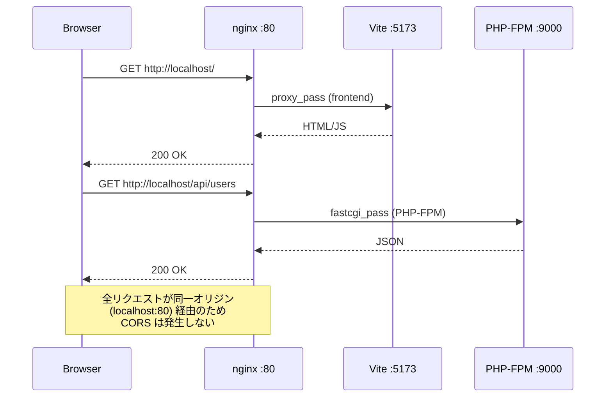

> **万が一 CORS が必要になった場合**:  
> Laravel 側に `config/cors.php` が用意されている。`allowed_origins` を設定する。  
> ただし nginx リバースプロキシ構成では通常不要。

### 18.3 pnpm-lock.yaml と package.json の扱い

| やっていいこと | やってはいけないこと |
|--------------|------------------|
| `pnpm add <pkg>` で追加 → lock 自動更新 | `package.json` を手編集して lock をそのままにする |
| `pnpm install --frozen-lockfile` で CI 実行 | CI で `pnpm install`（lock なし）を実行 |
| lock ファイルを Git にコミット | `.gitignore` に `pnpm-lock.yaml` を追加 |
| コンフリクト時は `pnpm install` で再生成 | lock のコンフリクトを手動マージ |

### 18.4 Docker 関連のよくあるトラブルと対処

| 症状 | 原因 | 対処 |
|------|------|------|
| ディスクフル（Docker が肥大化） | 未使用イメージ / ボリュームの蓄積 | `docker system prune -a --volumes`（**注意: 全データ削除**） |
| ビルドが異常に遅い | Docker Desktop のリソース制限 | CPU / メモリ割り当てを増やす |
| コンテナ間で通信できない | ネットワーク名の不一致 | `docker network ls` で `appnet` の存在を確認 |
| `.env` 変更が反映されない | Docker Compose のキャッシュ | `make down && make up` で再作成 |
| `make setup` で `key:generate` 失敗 | app コンテナがまだ起動していない | `make build` → `make init` を順番に |

### 18.5 PHP / Laravel 固有の注意点

```bash
# .env を変更したら必ずキャッシュクリア
php artisan config:clear

# composer.json を変更したら autoload 再生成
composer dump-autoload

# マイグレーションファイルを修正した場合（本番 NG）
# 新しいマイグレーションを作成して alter する
php artisan make:migration alter_xxx_table --table=xxx

# Eloquent のクエリをデバッグ
\DB::enableQueryLog();
// ... クエリ実行 ...
dd(\DB::getQueryLog());
```

---

## 19. 開発フロー図

### 19.1 日常の開発ワークフロー

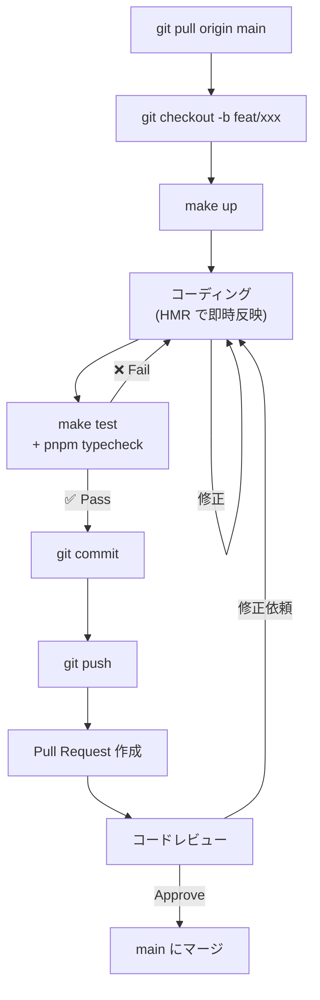

### 19.2 Docker コンテナ間の通信（開発環境）

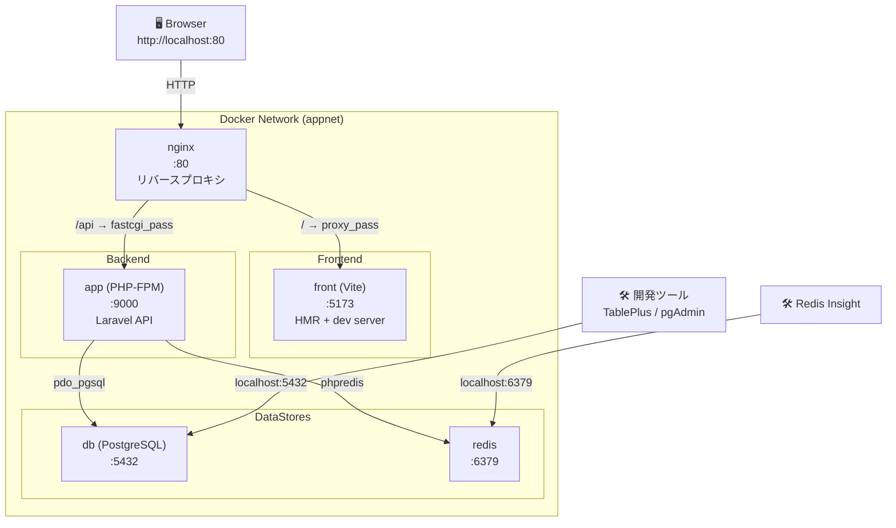

### 19.3 本番デプロイアーキテクチャ（AWS 想定）

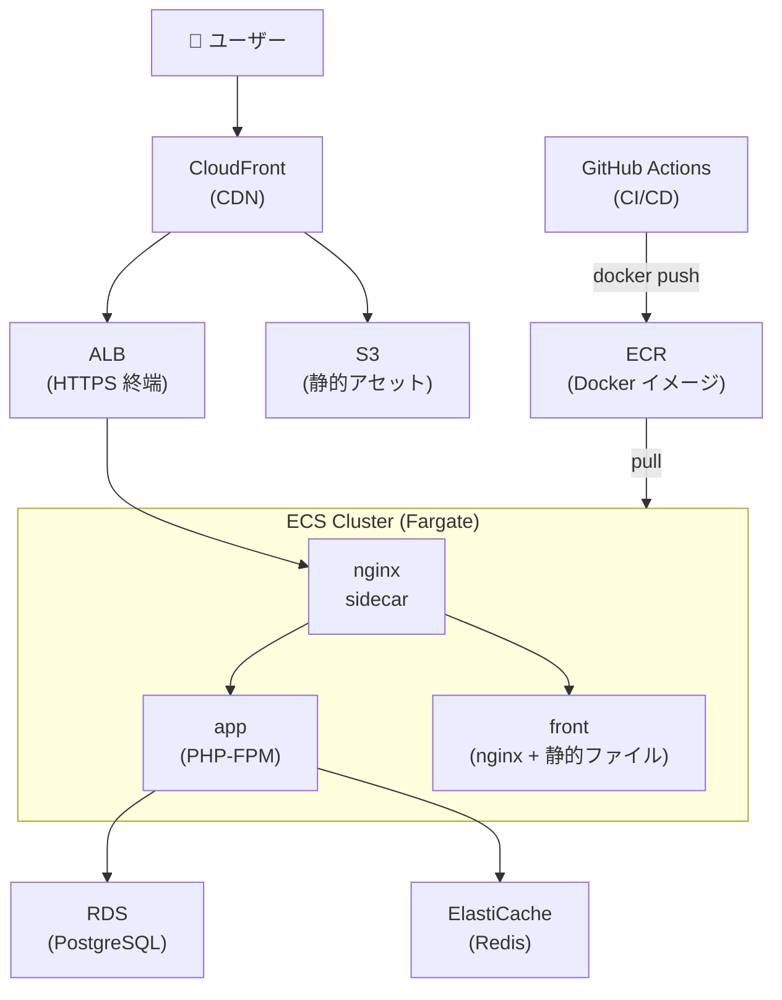

---

## 20. チェックリスト

### 20.1 開発前の確認事項

開発環境を立ち上げる前に確認するリスト。

- [ ] Docker Desktop / Docker Engine が起動している
- [ ] `docker compose version` で v2 以上が表示される
- [ ] `.env` ファイルが存在する（なければ `cp .env.example .env`）
- [ ] `back/.env` ファイルが存在する（なければ `cp back/.env.example back/.env`）
- [ ] `front/.env` ファイルが存在する（なければ `cp front/.env.example front/.env`）
- [ ] `POSTGRES_PASSWORD` がデフォルト値から変更されている
- [ ] ポート 80, 5432, 6379 が他のプロセスで使用されていない
- [ ] `make build` が正常に完了する
- [ ] `make init` が正常に完了する（初回のみ）
- [ ] `http://localhost` にアクセスしてフロントが表示される
- [ ] `http://localhost/api/health` が 200 を返す

### 20.2 デプロイ前の確認事項

本番にデプロイする前に確認するリスト。

- [ ] `main` ブランチが最新の状態になっている
- [ ] 全テストが通過している（`make test` + `pnpm typecheck` + `pnpm lint`）
- [ ] マイグレーションが正しく適用される（`php artisan migrate --pretend` で確認）
- [ ] `APP_ENV=production` / `APP_DEBUG=false` が設定されている
- [ ] `APP_KEY` / `JWT_SECRET` が本番用に設定されている
- [ ] 環境変数に機密情報がハードコードされていない
- [ ] 不要な `dd()` / `console.log()` が残っていない
- [ ] `docker-compose.prod.yml` でビルド・起動できる
- [ ] `php artisan optimize` が正常に完了する
- [ ] nginx 設定のセキュリティヘッダが有効
- [ ] DB / Redis のポートが外部公開されていない
- [ ] ソースマップの公開ポリシーを確認（必要に応じて `sourcemap: false`）
- [ ] `composer audit` / `pnpm audit` で脆弱性がゼロ

### 20.3 本番運用時の注意事項

運用中に定期的に確認するリスト。

- [ ] ログローテーションが正しく機能している（`json-file` / `max-size: 10m × 3`）
- [ ] ディスク使用量が閾値以下（Docker ボリューム含む）
- [ ] DB のバックアップが定期的に取得されている
- [ ] SSL/TLS 証明書の有効期限が切れていない
- [ ] `composer audit` / `pnpm audit` を月次で実行
- [ ] Docker ベースイメージのセキュリティパッチを適用
- [ ] `docker stats` でリソース使用状況を確認
- [ ] PHP-FPM のプロセス数が適切か（`pm.max_children`）
- [ ] PostgreSQL の接続数が上限に達していないか
- [ ] Redis のメモリ使用量が `maxmemory` を超えていないか
- [ ] エラーログに未対応の例外が蓄積していないか
- [ ] `php artisan schedule:list` のスケジュールタスクが正常に動作しているか

---

## 21. トラブルシューティング早見表

| # | 症状 | 疑うべき箇所 | 対処コマンド |
|---|------|-------------|-------------|
| 1 | 全コンテナが起動しない | Docker Engine 停止 | `sudo systemctl start docker` |
| 2 | app だけ再起動を繰り返す | entrypoint.sh のパーミッション | `chmod +x back/docker/entrypoint.sh` |
| 3 | DB 接続エラー | `.env` の `DB_HOST` が `localhost` | `DB_HOST=db` に修正 |
| 4 | Redis 接続エラー | Redis コンテナ未起動 | `make ps` で確認 → `make up` |
| 5 | 502 Bad Gateway | PHP-FPM がまだ起動していない | ヘルスチェック完了を待つ |
| 6 | フロント白画面 | Vite ビルドエラー | `make logs` で front ログ確認 |
| 7 | HMR 効かない | ファイル監視の問題 | `CHOKIDAR_USEPOLLING=true` 確認 |
| 8 | `make` コマンドが見つからない | make 未インストール | `sudo apt install make` |
| 9 | ポート競合 | 80/5432/6379 が使用中 | `lsof -i :<port>` → プロセス終了 |
| 10 | イメージビルドが遅い | Docker キャッシュ無効 | `docker builder prune` で不要キャッシュ削除 |
| 11 | `pnpm: command not found` (コンテナ内) | corepack 未有効化 | Dockerfile で `RUN corepack enable` 確認 |
| 12 | migrate 失敗 | DB コンテナのヘルスチェック未完了 | `depends_on: condition: service_healthy` 確認 |

---

## 22. コマンドクイックリファレンス

日常的に使うコマンドをまとめた速引き表。

```bash
# ═══════════════════════════════════════════════
#  起動・停止
# ═══════════════════════════════════════════════
make up                  # 開発環境を起動
make down                # 停止
make restart             # 再起動
make build               # リビルド＋起動
make build ENV=prod      # 本番ビルド＋起動

# ═══════════════════════════════════════════════
#  Laravel
# ═══════════════════════════════════════════════
make sh                  # app コンテナに入る
make migrate             # マイグレーション
make seed                # シーダー
make fresh               # DB リセット (dev 限定)
make test                # PHPUnit

# ═══════════════════════════════════════════════
#  フロントエンド
# ═══════════════════════════════════════════════
make front-install       # pnpm install (ホスト)
make front-dev           # Vite dev server (ホスト)
make front-build         # 本番ビルド (ホスト)
make front-typecheck     # TypeScript 型チェック
make front-lint          # ESLint

# ═══════════════════════════════════════════════
#  OpenAPI
# ═══════════════════════════════════════════════
make openapi             # 全自動生成 (bundle + client + zod)
make openapi-bundle      # YAML バンドル
make openapi-client      # orval → API クライアント
make openapi-zod         # Zod スキーマ生成

# ═══════════════════════════════════════════════
#  デバッグ・調査
# ═══════════════════════════════════════════════
make logs                # 全コンテナログ
make ps                  # コンテナ一覧
make health              # ヘルスチェック
docker stats             # リソース使用状況
docker system df         # ディスク使用量
```

---

> **このドキュメントに関する質問・改善提案は Issue または PR で受け付けています。**