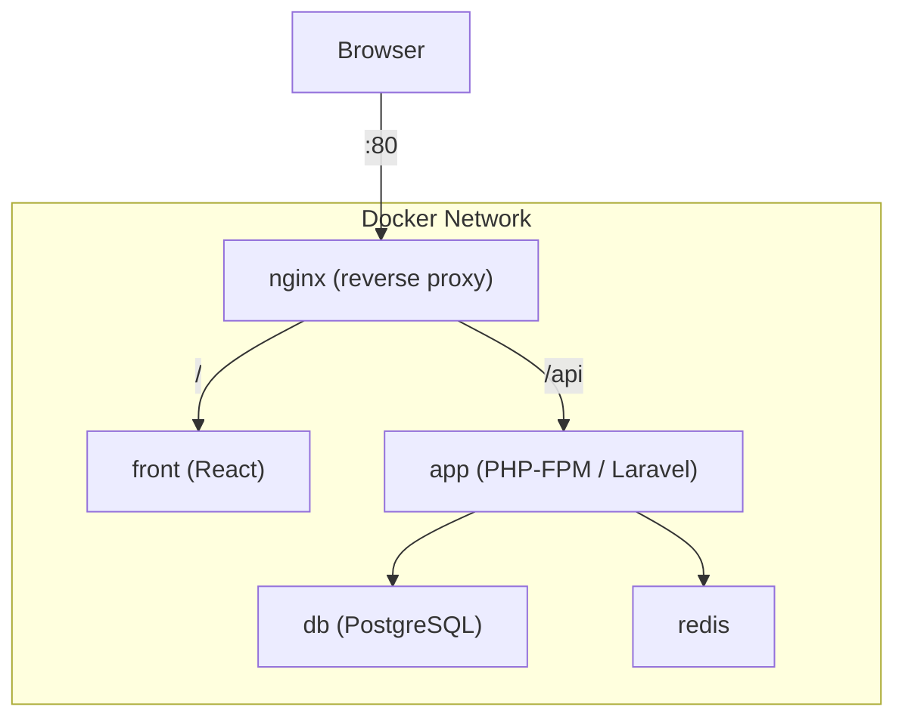

# Time Attendance System — Infrastructure Guide

## 1. 概要

React + Laravel + Docker による勤怠管理システム。  
nginx をリバースプロキシとし、フロントとバックを完全分離。  
ローカル・本番・CI で同一 Docker 構成を使用する。

---

## 2. アーキテクチャ図



| パス | 転送先 | 備考 |
|------|--------|------|
| `/` | front (Vite:5173 / nginx:80) | dev=Vite, prod=nginx |
| `/api/*` | app:9000 (FastCGI) | Laravel |

---

## 3. ディレクトリ構成

```
root/
├── front/                   # React フロントエンド
│   ├── src/
│   ├── public/
│   ├── package.json
│   └── .env.example
│
├── back/                    # Laravel API バックエンド
│   ├── app/
│   ├── composer.json
│   ├── docker/
│   │   └── entrypoint.sh
│   └── .env.example
│
├── infra/                   # インフラ定義
│   ├── docker-compose.yml          # ベース（全環境共通）
│   ├── docker-compose.override.yml # dev オーバーライド（自動読込）
│   ├── docker-compose.prod.yml     # 本番オーバーライド
│   │
│   ├── nginx/
│   │   ├── nginx.conf              # メイン設定（gzip / server_tokens off）
│   │   └── conf.d/
│   │       ├── app.conf            # 本番用 server ブロック
│   │       ├── app.dev.conf        # 開発用 server ブロック（Vite proxy + HMR）
│   │       └── api.conf            # /api location（共通 include）
│   │
│   ├── php/
│   │   ├── Dockerfile              # PHP-FPM マルチステージ
│   │   ├── php.ini                 # 開発用 PHP 設定
│   │   ├── php.prod.ini            # 本番用 PHP 設定
│   │   └── xdebug.ini             # Xdebug（dev のみマウント）
│   │
│   ├── node/
│   │   ├── Dockerfile              # Node / React マルチステージ
│   │   └── entrypoint.sh           # pnpm install 自動実行
│   │
│   ├── postgres/
│   │   └── init.sql                # DB 初期化スクリプト
│   │
│   └── redis/
│
├── .env.example             # Docker Compose 変数テンプレート
├── Makefile
└── .gitignore
```

---

## 4. 環境変数

| 対象 | ファイル | 用途 |
|------|---------|------|
| Docker Compose | `.env` | ビルドターゲット / ポート / DB 接続情報 |
| Laravel | `back/.env` | アプリ設定（Docker 環境変数で上書き） |
| React | `front/.env.local` | Vite 変数（`VITE_` prefix） |

> **セキュリティ**: `.env` / `.env.local` は `.gitignore` 済み。`.env.example` のみ Git 管理。

---

## 5. セットアップ & 起動手順

### 5.1 初回セットアップ

```bash
# 1. リポジトリをクローン
git clone <repo-url> && cd time-attendance

# 2. 環境変数をコピー
cp .env.example .env
cp back/.env.example back/.env
cp front/.env.example front/.env.local

# 3. .env の POSTGRES_PASSWORD を変更
vi .env

# 4. ビルド & 起動 & DB 初期化
make setup
```

`make setup` は自動で以下を実行する:
1. `.env` ファイルが無ければコピー
2. Docker イメージをビルド
3. `php artisan key:generate` / `jwt:secret`
4. `php artisan migrate --seed`

### 5.2 日常の開発

```bash
make up          # 起動    → http://localhost
make down        # 停止
make build       # イメージ再ビルド & 起動
make logs        # ログ確認
make sh          # app コンテナに入る
```

### 5.3 本番ビルド

```bash
make build ENV=prod
make up ENV=prod
```

---

## 6. Make コマンド一覧

| コマンド | 説明 |
|---------|------|
| `make setup` | 初回セットアップ（.env コピー + ビルド + DB 初期化） |
| `make up` | コンテナ起動 |
| `make down` | コンテナ停止 |
| `make build` | ビルド & 起動 |
| `make restart` | down → up |
| `make logs` | ログ表示 |
| `make ps` | コンテナ一覧 |
| `make sh` | app コンテナに入る |
| `make migrate` | マイグレーション実行 |
| `make seed` | シーダー実行 |
| `make fresh` | DB リセット + migrate + seed |
| `make test` | テスト実行 |

本番は `ENV=prod` を付与:

```bash
make up ENV=prod
make build ENV=prod
```

---

## 7. dev / prod の差分

| 項目 | dev (override.yml) | prod (prod.yml) |
|------|-------------------|-----------------|
| PHP Dockerfile target | `dev` | `prod` |
| Front Dockerfile target | `dev` (Vite) | `prod` (nginx + 静的ファイル) |
| Xdebug | 有効（xdebug.ini マウント） | 無効 |
| nginx app.conf | `app.dev.conf`（Vite proxy） | `app.conf`（frontend upstream） |
| ソースマウント | back/ / front/ をバインド | イメージに COPY |
| DB/Redis ポート | ホストに公開 | 公開しない |
| PHP エラー表示 | `display_errors = On` | `display_errors = Off` |
| opcache | `validate_timestamps = 1` | `validate_timestamps = 0` |
| リソース制限 | なし | `mem_limit` / `cpus` 設定済み |
| ログ | stdout | json-file (max-size 10m × 3) |

---

## 8. nginx ルーティング詳細

### 全体フロー

```
nginx.conf
  └── include conf.d/app.conf
        └── include conf.d/api.conf
```

- `nginx.conf`: gzip, server_tokens off, worker 設定
- `app.conf` (prod): upstream frontend → front:80 (nginx)
- `app.dev.conf` (dev): upstream frontend → front:5173 (Vite) + WebSocket upgrade
- `api.conf`: `/api` → PHP-FPM (fastcgi_pass app:9000)

### CORS を発生させない仕組み

ブラウザは `localhost:80` (nginx) にのみアクセスする。  
`/api` も同一オリジン経由で nginx が PHP-FPM に中継するため、CORS ヘッダは不要。

---

## 9. よくあるエラーと対処

### DB に接続できない

```
SQLSTATE[08006] Connection refused
```

**原因**: `DB_HOST=localhost` になっている。  
**対処**: Docker 内では `DB_HOST=db`（サービス名）を使う。Compose の `environment` で自動注入される。

### CORS エラー

```
Access-Control-Allow-Origin header is missing
```

**原因**: フロントが `localhost:5173` から直接 `localhost:8000/api` を叩いている。  
**対処**: すべて nginx (`:80`) 経由でアクセスする。Vite の `VITE_API_BASE_URL=/api`（相対パス）を確認。

### front コンテナで node_modules が空

```
Error: Cannot find module 'vite'
```

**原因**: Volume マウントが node_modules を上書きしている。  
**対処**: `entrypoint.sh` が自動で `pnpm install` を実行する。初回は時間がかかる。

### nginx 502 Bad Gateway

**原因**: app コンテナ（PHP-FPM）がヘルスチェック前にリクエストを受けた。  
**対処**: nginx は `depends_on: app: condition: service_healthy` で待機する。ヘルスチェック通過まで待つ。

### Xdebug が動かない

**原因**: `xdebug.client_host=host.docker.internal` が Linux で解決できない。  
**対処**: Linux の場合、`infra/php/xdebug.ini` の `client_host` をホストの Docker ブリッジ IP (例: `172.17.0.1`) に変更する。

### PHP artisan コマンドが失敗

```
The bootstrap/cache directory must be writable
```

**対処**: `make sh` でコンテナに入り、`chmod -R ug+rwX storage bootstrap/cache` を実行。entrypoint.sh が自動で対処するが、UID 不一致の場合は手動で修正。

---

## 10. アンチパターン（やってはいけないこと）

### 1. `.env` を Git にコミットする

秘密情報（DB パスワード、JWT_SECRET 等）が漏洩する。  
→ `.env.example` のみコミットし、`.env` は `.gitignore` で除外済み。

### 2. Docker を使わずにローカルで直接起動する

PHP / Node のバージョン差異で環境依存バグが発生する。  
→ 必ず Docker 経由で開発する。

### 3. `localhost:5173` を直接ブラウザで開く

CORS エラーが発生する。nginx を経由しないと API リクエストが別オリジンになる。  
→ `http://localhost`（nginx 経由）にアクセスする。

### 4. DB ポートをホストに公開したまま本番にデプロイする

`docker-compose.override.yml` の `ports: 5432:5432` は dev 限定。  
→ 本番では `docker-compose.prod.yml` を使用し、DB/Redis ポートは外部公開しない。

### 5. 本番で Xdebug を有効にする

Xdebug は PHP の実行速度を大幅に低下させる。  
→ `infra/php/xdebug.ini` は `docker-compose.override.yml` でのみマウントされる。

### 6. `node_modules` をホストからバインドマウントする

OS 依存のネイティブモジュール（esbuild 等）が壊れる。  
→ `front_node_modules` 名前付きボリュームで隔離済み。

### 7. `docker-compose.prod.yml` で `APP_DEBUG=true` にする

スタックトレースやデバッグ情報がブラウザに表示される。  
→ 本番では `APP_DEBUG=false` を厳守。

### 8. nginx を飛ばして PHP-FPM に直接リクエストする

FastCGI プロトコルは HTTP ではない。`curl app:9000` は動かない。  
→ 必ず nginx → FastCGI 経由でアクセスする。

### 9. `docker compose up` を infra ディレクトリ外で `-f` なしに実行する

Compose ファイルが見つからずエラーになるか、間違ったファイルが読み込まれる。  
→ `make up` を使うか、`-f` でパスを明示する。

### 10. 全コンテナを同一メモリ制限にする

DB に 128MB、Redis に 1GB 等の不適切な割り当ては OOM を招く。  
→ `docker-compose.prod.yml` でサービスごとに適切な `mem_limit` を設定済み。

---

## 11. 今後の拡張

- AWS デプロイ（ECS / Fargate / RDS / ElastiCache / S3 / CloudFront）
- CI/CD（GitHub Actions: lint → test → build → deploy）
- メールサービス（Mailpit for dev / SES for prod）
- ログ集約（CloudWatch / Datadog）