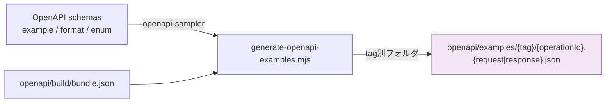
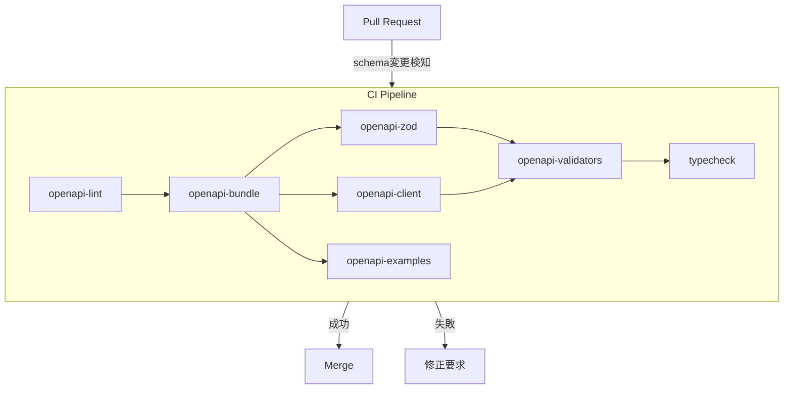

# OpenAPI スキーマ管理

TimeAttendance API のスキーマ定義、コード生成、バリデーション管理のドキュメント。

## ディレクトリ構造

```
openapi/
├── openapi.yaml                  # メインドキュメント（エントリポイント）
├── paths/                        # エンドポイント定義（API 別ファイル）
│   ├── auth.yaml                 #   POST /login, /logout, GET /authme
│   ├── attendance.yaml           #   GET /attendances/attendance, POST clock-in/out
│   ├── dashboard.yaml            #   GET /dashboard
│   ├── schedule.yaml             #   GET /auth/calendar
│   ├── settings.yaml             #   GET/PUT /settings
│   └── team.yaml                 #   GET /team/members
├── components/
│   ├── securitySchemes.yaml      # JWT Bearer 認証定義
│   ├── responses.yaml            # 共通エラーレスポンス (401/403/404/409/422/500)
│   └── schemas/                  # リクエスト/レスポンス型定義
│       ├── auth/                 #   LoginRequest, LoginResponse, UserResponse
│       ├── attendance/           #   ClockIn/Out, Index, Store, Update Request, Response
│       ├── dashboard/            #   DashboardClockRequest, DashboardResponse
│       ├── schedule/             #   CalendarIndexRequest, CalendarResponse, CalendarSummary, CalendarDay
│       ├── settings/             #   SettingsResponse, UpdateSettingsRequest
│       ├── team/                 #   TeamMembersResponse, TeamMember
│       └── common/               #   ErrorResponse, ValidationErrorResponse
├── schema/
│   └── fields.yaml               # フィールドメタデータ（ラベル・型・必須）
├── examples/                     # ⚠️ 自動生成 — 手動編集禁止
│   ├── auth/                     #   {operationId}.request.json / .response.json
│   ├── attendance/
│   ├── dashboard/
│   ├── schedule/
│   ├── settings/
│   ├── team/
│   └── common/                   #   ErrorResponse, ValidationErrorResponse
└── build/                        # 生成済みバンドル（git 追跡外）
    ├── bundle.yaml               #   Redocly でバンドルされた YAML
    └── bundle.json               #   dereferenced JSON（バリデータ生成用）
```

## コード生成フロー

```mermaid
flowchart TD
    A[openapi/openapi.yaml] -->|redocly bundle| B[openapi/build/bundle.yaml]
    A -->|redocly bundle --dereferenced| C[openapi/build/bundle.json]

    B -->|openapi-zod| D[front/src/__generated__/zod.ts]
    B -->|orval| E[front/src/__generated__/]

    E --> E1[model/*.ts — TypeScript 型]
    E --> E2["{tag}/{tag}.ts — API フック"}]

    D --> F[generate-openapi-validators.mjs]
    C --> F
    G[openapi/schema/fields.yaml] --> F

    F --> H[front/src/__generated__/zod.validation.ts]
    F --> I[front/src/__generated__/field-labels.json]
    F --> J[back/app/Http/Requests/Generated/OpenApiGeneratedRules.php]

    C -->|openapi-sampler| K[generate-openapi-examples.mjs]
    K --> L[openapi/examples/**/*.json]

    style A fill:#e1f5fe
    style G fill:#fff3e0
    style H fill:#e8f5e9
    style I fill:#e8f5e9
    style J fill:#fce4ec
    style L fill:#f3e5f5
```

## 生成コマンド

| コマンド | 説明 |
|---|---|
| `make openapi` | 全生成パイプライン実行 |
| `make openapi-bundle` | YAML/JSON バンドルのみ |
| `make openapi-zod` | Zod スキーマ生成 |
| `make openapi-client` | Orval API クライアント生成 |
| `make openapi-validators` | バリデータ + ラベル + Laravel ルール生成 |
| `make openapi-examples` | サンプル JSON 自動生成 |
| `make openapi-lint` | Redocly lint でスキーマ検証 |
| `make openapi-clean` | 全生成物を削除 |
| `npm run openapi:generate` | npm 経由で全生成 |

## 生成物の出力先

```mermaid
flowchart LR
    subgraph Frontend["front/src/__generated__/"]
        Z[zod.ts — Zod スキーマ]
        ZV[zod.validation.ts — 拡張バリデーション]
        FL[field-labels.json — フィールドラベル]
        M[model/*.ts — TypeScript 型定義]
        API["{tag}/*.ts — TanStack Query フック"}]
    end

    subgraph Backend["back/app/Http/Requests/Generated/"]
        LR[OpenApiGeneratedRules.php — Laravel ルール]
    end

    G[openapi-generate] --> Frontend
    G --> Backend
```

## スキーマ設計方針

### 1. ドメイン分割
スキーマは API ドメインごとにディレクトリを分割。共通のエラーレスポンスは `common/` に配置。

### 2. `$ref` 参照規約
```yaml
# paths → schemas 参照
$ref: "../components/schemas/auth/LoginRequest.yaml#/LoginRequest"

# paths → responses 参照
$ref: "../components/responses.yaml#/Unauthorized"

# schemas 内の相互参照
$ref: "#/CalendarDay"
```

### 3. fields.yaml の役割
`openapi/schema/fields.yaml` はスキーマ定義とは独立したフィールドメタデータ。
UI ラベル生成と Laravel バリデーションルール生成に使用。

```yaml
attendance:
  work_date:
    type: date
    label: 勤務日        # → field-labels.json / zod.validation.ts
    required: true
    description: 勤務対象日
```

### 4. examples の自動生成

`openapi/examples/` は **自動生成ファイル** であり、手動編集は禁止。



**生成ルール:**

| 項目 | ルール |
|---|---|
| ディレクトリ | 1st タグ名を lowercase (`Auth` → `auth/`) |
| ファイル名 | `{operationId}` を kebab-case + `.request.json` / `.response.json` |
| サンプル値 | スキーマの `example` フィールド優先、なければ型ベースの自動生成 |
| 上書き | 毎回 `examples/` を全削除→再生成（**既存ファイルは上書きされる**） |
| 禁止事項 | 各ファイルに `_comment` で手動編集禁止を明示 |

**サンプル値をカスタマイズするには:**
スクリプトを編集するのではなく、**OpenAPI スキーマ側に `example` フィールドを追加**する。

```yaml
# openapi/components/schemas/auth/LoginRequest.yaml
LoginRequest:
  type: object
  properties:
    email:
      type: string
      format: email
      example: "t.tanaka@example.com"   # ← この値が examples/ に反映される
```

## FormRequest 連携

OpenAPI スキーマから生成された `OpenApiGeneratedRules.php` は、Laravel の FormRequest と連携してバリデーションルールを自動適用する。

```mermaid
flowchart LR
    S[OpenAPI schemas] -->|generate-openapi-validators.mjs| R[OpenApiGeneratedRules.php<br/>SCHEMA_RULES / SCHEMA_ATTRIBUTES]
    R -->|schema()| BR[BaseRequest::rules]
    R -->|schemaAttributes()| BA[BaseRequest::attributes]
    BR --> FR[FormRequest extends BaseRequest<br/>$schemaName = 'XXXRequest']
    BA --> FR
    FR --> C[Controller メソッド]

    style S fill:#e1f5fe
    style R fill:#fce4ec
    style FR fill:#fff3e0
```

**FormRequest の作り方:**

```php
// back/app/Http/Requests/Attendance/AttendanceStoreRequest.php
class AttendanceStoreRequest extends BaseRequest
{
    protected string $schemaName = 'AttendanceStoreRequest';
}
```

`$schemaName` を指定するだけで、OpenAPI スキーマに基づくバリデーションルールとフィールド名が自動適用される。

| FormRequest | スキーマ名 | 用途 |
|---|---|---|
| `LoginRequest` | `LoginRequest` | ログイン |
| `DashboardClockRequest` | `DashboardClockRequest` | ダッシュボード打刻 |
| `CalendarIndexRequest` | `CalendarIndexRequest` | カレンダー (year/month) |
| `AttendanceIndexRequest` | `AttendanceIndexRequest` | 勤怠一覧 (from/to) |
| `AttendanceStoreRequest` | `AttendanceStoreRequest` | 勤怠登録 |
| `AttendanceUpdateRequest` | `AttendanceUpdateRequest` | 勤怠更新 |
| `UpdateSettingsRequest` | `UpdateSettingsRequest` | 設定更新 |

## CI/CD 統合



### GitHub Actions 例

```yaml
- name: OpenAPI Lint
  run: make openapi-lint

- name: Generate API Client & Examples
  run: make openapi

- name: Type Check
  run: make front-typecheck
```

## 新しいエンドポイントの追加手順

1. `openapi/components/schemas/{domain}/` にリクエスト/レスポンスのスキーマ YAML を作成
2. `openapi/paths/{domain}.yaml` にパス定義を追加（`$ref` でスキーマ参照）
3. `openapi/openapi.yaml` の `paths:` セクションに新パスを追記
4. クエリパラメータ用スキーマは `openapi.yaml` の `components.schemas` にも `$ref` を追記
5. `openapi/schema/fields.yaml` にフィールドメタデータを追加（必要に応じて）
6. `make openapi` で全コード生成を実行（OpenApiGeneratedRules.php も自動更新される）
7. `back/app/Http/Requests/{Domain}/` に FormRequest クラスを作成し `$schemaName` を設定
8. コントローラーメソッドに FormRequest を型ヒントで注入
9. `make front-typecheck` で型整合性を確認
